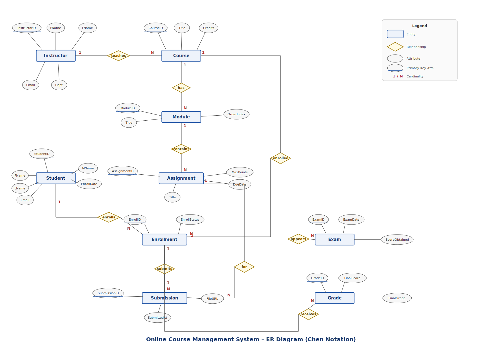

# Online-Course-Management-System
Welcome to Online Course Mangement system Project!

# Project Overview
  The Online Course Management System simplifies the administration of online learning platforms by storing and managing data in a structured database. The project demonstrates core DBMS concepts such as table creation, relationships, data insertion, and query execution using PostgreSQL.

# Basic Structure
## Database Entities
 There are 9 entities in this database. They are
 - Student
 - Instructor
 - Course
 - Enrollment
 - Module
 - Assignment
 - Submission
 - Exam
 - Grade

 Each entity consists of several attributes.
 ## Entity Relationship diagram
 
